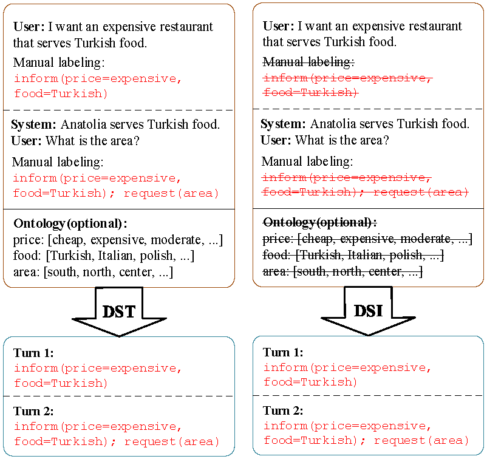
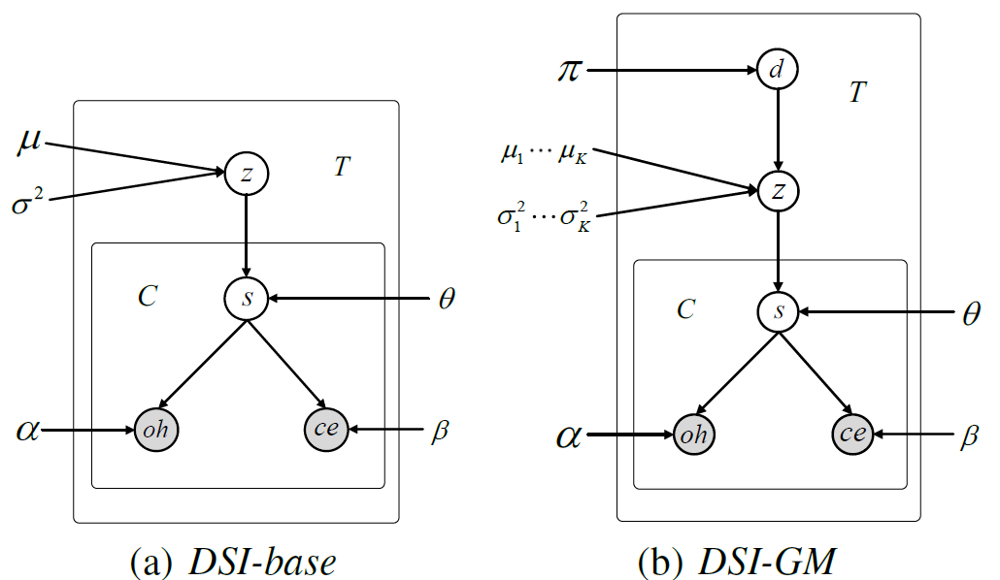

Code for paper ["Dialogue State Induction Using Neural Latent Variable Models"](https://www.ijcai.org/Proceedings/2020/0532.pdf), IJCAI 2020.
# Dialogue State Induction (DSI)
Dialogue state induction aims at automatically induce dialogue states from raw dialogues. We assume that there is a large set of dialogue records of many different domains, but without manual labeling of dialogue states. Such data are relatively easy to obtain, for example from customer service call records from different businesses. Consequently, we propose the task of **dialogue state induction** (DSI), which is to automatically induce slot-value pairs from raw dialogue data.
The difference between DSI and DST is illustrated in Figure 1.


*Figure 1: Comparison between DSI and traditional DST. The strikeghtough font is used to rpresent the resources not needed by DSI. The dialogue state is accumulated as the dialogue proceeds. Turns are separately by dashed lines. Dialogues and external ontology are separated by black lines*

In paricular, we use two neural latent variable models (actually one model together with its multi-domain variant) to induce dialogue states. Two datasets, e.g., MultiWOZ2.1 and SGD, are used in our experiments.

## Neural Latent Variable Models
In this work, we introduce two incrementally complex neural latent variable models for DSI by treating th whole state and each slot as latent variables. 


## Experiments
We evaluate our proposed DSI task on two dataset: [MultiWOZ 2.1](https://github.com/budzianowski/multiwoz) and [SGD](https://github.com/google-research-datasets/dstc8-schema-guided-dialogue).
We consider two evaluation metrics:
1. State Matching (Precision, Recall and F1-score in Table
1): To evaluate the overlapping of induced states and the ground truth.
2. Goal Accuracy (Accuracy in Table 1): The predicted dialogue states for a turn is considered as true only when all the user search goal
constraints are correctly and exactly identified.

We evaluate both metrics in both the turn level and the joint level (Table 1). The joint-level dialogue state is the typical definition of dialogue state, which reflects the user goal from the beginning of the dialogue until the current turn, where turn-level state reflects local user goal at each dialogue turn. The joint level metrics are more strict in jointly considering the output of all turns. 

Note: A fuzzy matching mechanism is used to compare induced values with the ground truth, which is similar to the evaluation of SGD dataset.

<div class="datagrid" style="width:500px; text-align:center;">
<table>
<thead><tr><th></th><th colspan="4">MultiWOZ 2.1</th><th colspan="4">SGD</th></tr></thead>
<thead><tr><th></th><th colspan="2">Turn Level</th><th colspan="2">Joint Level</th></tr></thead>
<thead><tr><th>Model</th><th>F1</th><th>Accuracy</th><th>F1</th><th>Accuracy</th><th>F1</th><th>Accuracy</th><th>F1</th><th>Accuracy</th></tr></thead>
<tbody>
<tr><td>DSI-base</td><td>37.3</td><td>25.7</td><td>32.1</td><td>2.3</td><td>26.0 </td><td>21.1</td><td>14.5</td><td>2.3</td></tr>
<tr><td>DSI-GM </td><td>49.6 </td><td>36.1</td><td>44.8</td><td>5.0</td><td>33.5 </td><td>27.5</td><td>19.5</td><td>3.1</td></tr>

</tbody>
</table>
</div>

# Pre-processing
For pre-processing, you can either directly download pre-processed files or build training data by yourself.

## Download
* from google drive: [MultiWOZ21](https://drive.google.com/file/d/1xrc-N9jA0g-ZXXUtGuICZxxHWVXrOl2t/view?usp=sharing), [SGD](https://drive.google.com/file/d/15xbUqu4txLpN2apOysYZobGjKUgAtcjj/view?usp=sharing)
* from BaiduNetDisk: [MultiWOZ21](https://pan.baidu.com/s/1u_jCiIc_eBevLq9NHrIjFg) (code: vr2a), [SGD](https://pan.baidu.com/s/1u_jCiIc_eBevLq9NHrIjFg) (code: et3q)

## Build data

### Required packages
1. python 3.7
2. pytorch>=1.0
3. allennlp
4. stanfordcorenlp


### Required files
1. `stanford-corenlp-full-2018-10-05`: preprocessing (candidate extraction) toolkit. Download from [stanfordnlp](http://nlp.stanford.edu/software/stanford-corenlp-full-2018-10-05.zip) and unzip it into `utils` folder.
2. `elmo pretrained model`: pretrained model. Download [weights file](https://s3-us-west-2.amazonaws.com/allennlp/models/elmo/2x1024_128_2048cnn_1xhighway/elmo_2x1024_128_2048cnn_1xhighway_weights.hdf5) and [options file](https://s3-us-west-2.amazonaws.com/allennlp/models/elmo/2x1024_128_2048cnn_1xhighway/elmo_2x1024_128_2048cnn_1xhighway_options.json) from allennlp and put them into `utils/elmo_pretrained_model` folder.

### Dataset
For MultiWOZ 2.1 dataset:
1. Download [MultiWOZ 2.1](https://github.com/budzianowski/multiwoz/tree/master/data).
2. Data preprocessing: Process MultiWOZ 2.1 to follow the data format of the Schema-Guided Dialogue dataset (to run the script, you need to install tensorflow).

`python multiwoz/create_data_from_multiwoz.py \
--input_data_dir=<downloaded_multiwoz2.1_dir> \
--output_dir data/multiwoz21`

For SGD dataset:
1. Download [SGD](https://github.com/google-research-datasets/dstc8-schema-guided-dialogue).
2. Put `train`, `dev` and `test` folders into `data/dstc8` folder.

### Run
Extract value candidates, extract features and build vocabulary.

`python build_data.py -t multiwoz21|dstc8`

# Model

## Required packages
1. python 3.7
2. pytorch>=1.0
3. numpy
4. fuzzywuzzy
5. tqdm
6. sklearn

## Training
`python train.py -t multiwoz|dstc8 -r train -m dsi-base|dsi-gm`

Configurations including data paths and model hyper-parameters are stored in `config.py`


## Prediction
`python train.py -t multiwoz21|dstc8 -r predict -m dsi-base|dsi-gm` 

# Reference
Please cite the following paper if you use any source codes in your work:

```
@inproceedings{min2020dsi,
  title={Dialogue State Induction Using Neural Latent Variable Models},
  author={Min, Qingkai and Qin, Libo and Teng, Zhiyang and Liu, Xiao and Zhang, Yue},
  booktitle={IJCAI},
  pages={3845--3852},
  year={2020}
}
```

